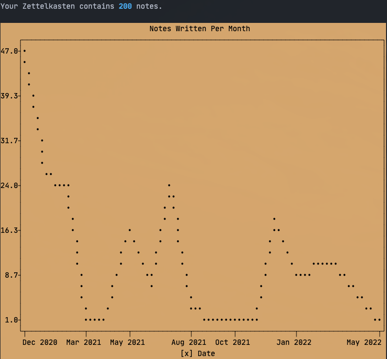

# Zettelkasten

If you want to access the zettelkasten, see: [index.md](zettel/index.md).

This is my personal [zettelkasten](https://en.wikipedia.org/wiki/Zettelkasten) based on the work of [Niklas Luhmann](https://en.wikipedia.org/wiki/Niklas_Luhmann). It all started after reading Edwin Wenink's post [building a note-taking system with vanilla vim](https://www.edwinwenink.xyz/posts/42-vim_notetaking/). At the end, he mentions that the folder structure became too complicated, and instead he plans to allow for organic growth zettelkasten style. I thought, "Wow, zettelkasten sounds German. My last name sounds German. I should look this up!". I find it crazy what motivates us. ~~Hours~~ ~~Days~~ Months later, and after going down the multiple ~~layers of hell~~ rabbit holes, I settled using [vimwiki](https://github.com/vimwiki) with the [vim-zettel](https://github.com/michal-h21/vim-zettel) plugin. I am using [Zotero](https://www.zotero.org) as my reference manager. ~~This set up is nice because with only a little of extra work it is fully compatible with [Zettlr](https://www.zettlr.com). Now, I have the option of a nice GUI, or I can stick to the command line, and Vim, and feel like a badass.~~ Update: I have been taking notes for almost a year and have never used the Zettlr after installing it. This is not a knock on Zettlr at all. I just really like vim.

## Visualization

Recently, I stumbled across [plotext](https://github.com/piccolomo/plotext) which creates plots and displays them right in the terminal. I wrote a little python script that finds all the notes in the zettel directory, sorts them by month and then plots a time series. Super fun! Here is my zettelkasten as of Jul 12, 2021. 

<br><br>

## Inspiration

The following sources have been influential in the creation and structure of my zettelkasten.
* [Zettelkasten.de](https://zettelkasten.de)
* [How to Take Smart Notes](https://takesmartnotes.com)
* [r/Zettelkasten](https://www.reddit.com/r/Zettelkasten/)
* [The Zettelkasten Manifesto](https://www.youtube.com/watch?v=c5Tst3-zcWI)
* [Understanding ZettelKasten](https://medium.com/@ethomasv/understanding-zettelkasten-d0ca5bb1f80e)
* [zk.zettel.page](https://zk.zettel.page)


## Configuration

I use markdown instead of the wiki syntax (partly because I am lazy and don't want to learn wiki, but mostly to make it more compatible with other resources I use). I added the `.md` when vimwiki creates a new file and changed the format of the file name to `yyyymmddHHMM.md`. This allows links to be clickable and files names to match when using Zettlr. In addition to vimwiki tags (e.g., :tag:) I also add hashtags (e.g., #tag). This allows me to search tags directly in Vim and use the tag feature in Zettlr.

In the last few months, I have started using nvim pretty much exclusively. It has been such a journey I don't remember exactly when I switched or the exact reason that made me switch, but [The Primeagen](https://www.youtube.com/channel/UC8ENHE5xdFSwx71u3fDH5Xw) had a lot to do with it. The most relevant reason to use nvim for Zettelkasten is [telescope](https://github.com/nvim-telescope/telescope.nvim). This makes it super easy to find notes. I've left the `fzf` and `fzf.vim` plugins included, but I mostly use telescope to navigate files. The only reason I still use `fzf` is for `[[` to insert the name of a zettel in the current zettel I am writing.

In addition, I have added the Vim plugins [pencil](https://github.com/reedes/vim-pencil) and ~~ [goyo](https:/github.com/junegunn/goyo.vim) ~~ [zen-mode](https://github.com/folke/zen-mode.nvim) to make the writing experience more enjoyable. Vim livedown allows me to render the markdown in a browser in case I want to see it before committing.

~~The portions of my `~/.vimrc` related to zettelkasten are found below. If you are interested in my full config checkout my [dotfiles](https://github.com/rhelmstedter/dotfiles). I use [Vim-Plug](https://github.com/junegunn/vim-plug) as my plugin manager.~~ I have made the switch to only using Nvim and have been slowly converting from `.vimrc` to `init.lua`. My [dotfiles](https://github.com/rhelmstedter/dotfiles) are still available, but almost everything has changed. I have also been on the search for a nvim zettelkasten plugin. [Telekasten](https://github.com/renerocksai/telekasten.nvim) looks promising, but I like the features of vim-zettel better. I will leave the config for `~/.vimrc` below in case it helps someone else, but if I ever decide to move on to a nvim only plugin I'll update remove it and point to my nvim config.

```vim
""{{{=====[ Vim-plug ]=========================================================

call plug#begin()
    Plug 'vimwiki/vimwiki'
    Plug 'junegunn/fzf'
    Plug 'junegunn/fzf.vim'
    Plug 'junegunn/goyo.vim'
    Plug 'michal-h21/vim-zettel'
    Plug 'shime/vim-livedown'
    Plug 'reedes/vim-pencil'
    Plug 'nvim-lua/plenary.nvim'
    Plug 'nvim-telescope/telescope.nvim'
call plug#end()

"}}}
"{{{=====[ Word Processing ]===================================================

"doesn't split words
set linebreak

"fix backspace
set backspace=indent,eol,start

"Replaces closest spelling error with number one suggestion. From Chris Toomey.
function! FixLastSpellingError()
    normal! mm[s1z=`m"
endfunction
nnoremap <leader>sc :call FixLastSpellingError()<cr>


"}}}
"{{{=====[ Vimwiki and Vim-zettel ]============================================

set nocompatible
filetype plugin on
let g:zettel_format = "%Y%m%d%H%M"
"Main zettelkasten plus two github repos I use for work
let g:vimwiki_list = [{'path': '~/Zettelkasten/zettel', 'syntax': 'markdown', 'ext': '.md'},
            \{'path': '~/Coding-in-Math-Class', 'syntax': 'markdown', 'ext': '.md'},
            \{'path': '~/coding-class', 'syntax': 'markdown', 'ext': '.md'}]

" Why learn vimwiki format when I sort of know markdown?
let g:vimwiki_markdown_link_ext = 1
let g:vimwiki_global_ext = 0
let g:vimwiki_ext2syntax = {'.md': 'markdown', '.markdown': 'markdown', '.mdown': 'markdown'}
let g:nv_search_paths = ['/Zettelkasten']
let g:zettel_options = [{"front_matter" : [["tags", ""], ["citation", ""]]}]
let g:markdown_fenced_languages = ['html', 'python', 'ruby', 'vim', 'lua']

"I prefer ripgrep to ag, but honestly I just use telescope now
let g:zettel_fzf_command = "rg --column --line-number --smart-case --no-heading --color=always"

"let g:fzf_layout = { 'window': { 'width': 0.9, 'height': 0.9 } }
let $FZF_DEFAULT_OPTS="--ansi --preview-window 'right:60%' --layout reverse --margin=1,4"
"Nice way to see how markdown will render
nmap gm :LivedownToggle<CR>

vnoremap nz :<C-U>ZettelNew<CR>

"adds #tags in addition to wiki tags for use in Zettlr
function! AddTags()
    normal! mm0wly$$p`mlv$:s/\%V:/ #/g
A€kb€kb€ýaF:lx$
endfunction
nnoremap <leader>at :call AddTags()<cr>
nnoremap <C-e> :Buffers<CR>

"toggle file type between md and vimwiki filetypes
nnoremap <leader>md :set filetype=markdown<CR>
nnoremap <leader>vw :set filetype=vimwiki<CR>

"open zettelkasten to search notes while working in vim
nnoremap <leader>zk :vsplit ~/Zettelkasten/zettel/index.md<cr> :cd %:p:h<cr>

"don't expand links in normal mode
augroup hide_links
	autocmd!
	autocmd FileType vimwiki set concealcursor=nc| set conceallevel=2|
	autocmd FileType markdown set concealcursor=nc| set conceallevel=2|
augroup END

"}}}
"{{{=====[ Telescope ]=========================================================

nnoremap <leader>ff <cmd>Telescope find_files<cr>
nnoremap <leader>fg <cmd>Telescope live_grep<cr>
nnoremap <leader>fb <cmd>Telescope buffers<cr>
nnoremap <leader>fh <cmd>Telescope help_tags<cr>
nnoremap <leader>fc <cmd>Telescope command_history<cr>

"}}}
"{{{=====[ Pencil ]============================================================

let g:pencil#wrapModeDefault = 'soft'   "default is 'hard'

augroup pencil
    autocmd!
    autocmd FileType markdown,mkd call pencil#init()
    autocmd FileType text         call pencil#init()
augroup END

"}}}
"{{{=====[ Goyo ]==============================================================

function! s:goyo_enter()
    set nonumber
    set nornu
endfunction

function! s:goyo_leave()
    set number
    set rnu
endfunction

augroup Goyo
    autocmd!
    autocmd! User GoyoEnter nested call <SID>goyo_enter()
    autocmd! User GoyoLeave nested call <SID>goyo_leave()
augroup END

nnoremap <leader>gy :Goyo<CR>
"}}}
```
