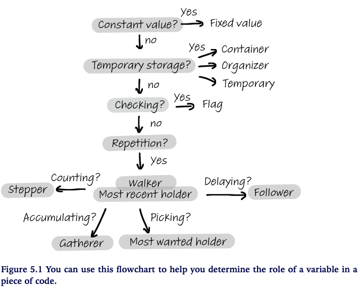

Hermans provides a flowchart for the 11 roles of variables.

| Role               | Icon |
|--------------------|:-----|
| Fixed Value        | ❌   |
| Stepper            | 🪜   |
| Flag               | 🚩   |
| Walker             | 🦶   |
| Most recent holder | 💱   |
| Most wanted holder | 💎   |
| Gatherer           | 🧺   |
| Container          | 📦   |
| Follower           | ↪️    |
| Organizer          | 🗃️   |
| Temporary          | ⏲️    |

It is good practice to be consistent. Examples that stick out to me are string methods in Python such as `.islower()` and `isupper()` are examples of flags that evaluate to booleans. After developing a fundamental understanding, the cognitive load is lowered and reading methods that start with `is` becomes a sign that it is a flag.
