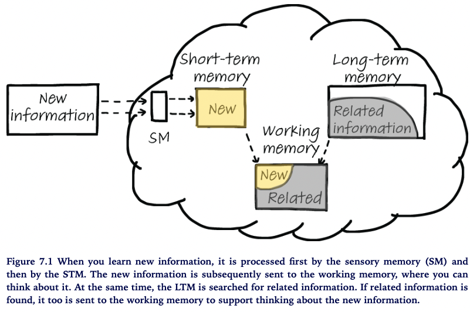

As new information enters your short-term memory, you should explicitly activate your working memory to see how it relates to information already stored in your long-term memory. It is easier to make sense of and retain new information when there exists context in the long-term memory. This process is called _transfer during learning_.

However, when people speak of _transfer_ in regards to learning, they almost always mean _transfer of learning_. This is when you apply information stored in long-term memory to new situations.

Transfer is a double edged sword. When existing knowledge supports new learning it is called _positive transfer_. However, existing knowledge may impede new learning too (_negative transfer_). Inaccurate notional machines and models may lead to misunderstandings. Correct notional machines and models in one domain, may not apply directly to a new topic and lead to misunderstandings.
